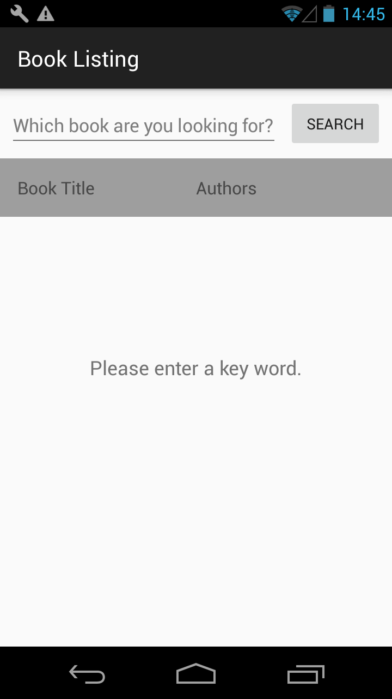
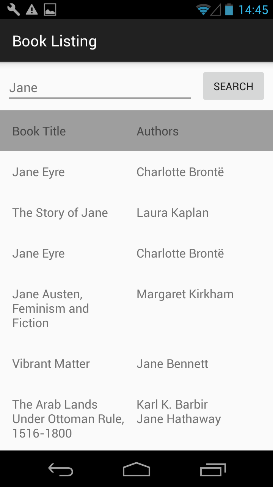
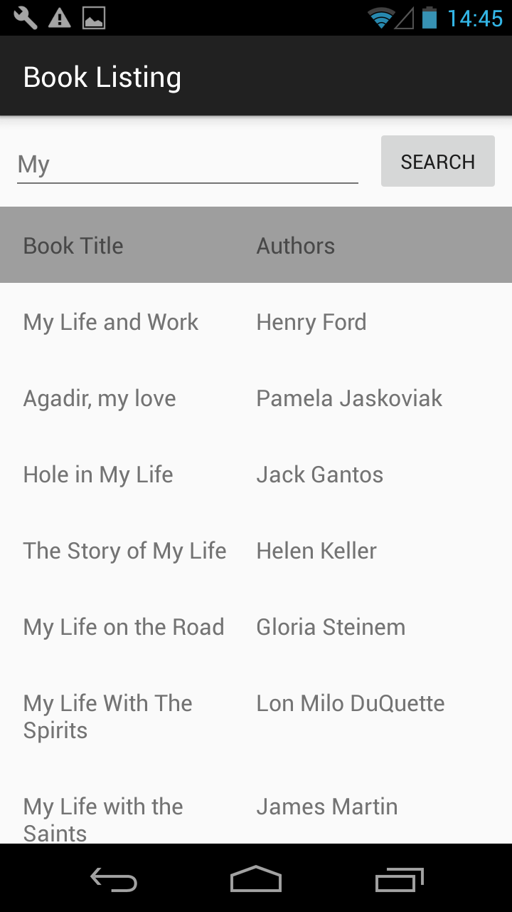
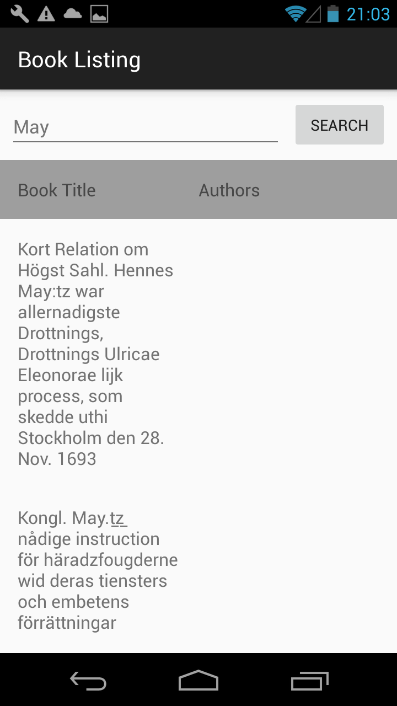
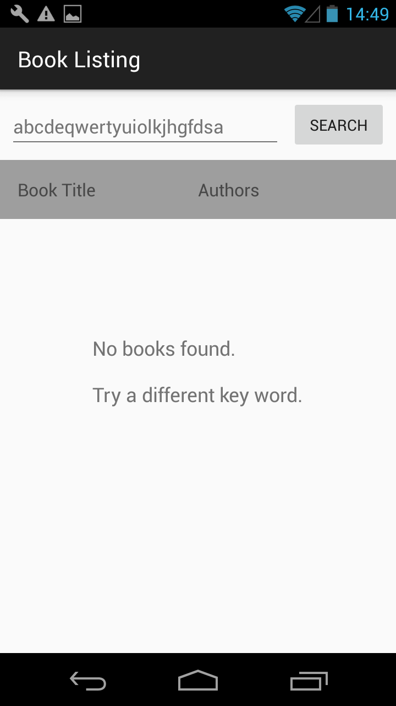
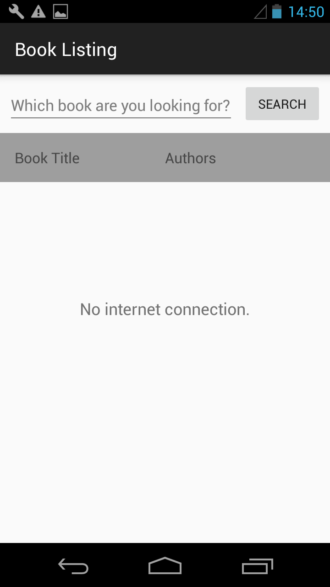
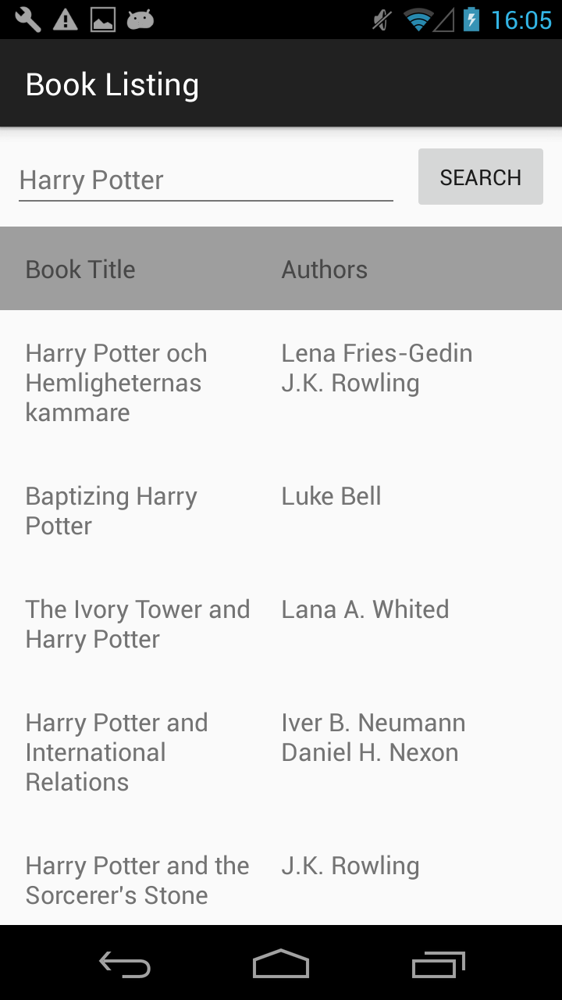
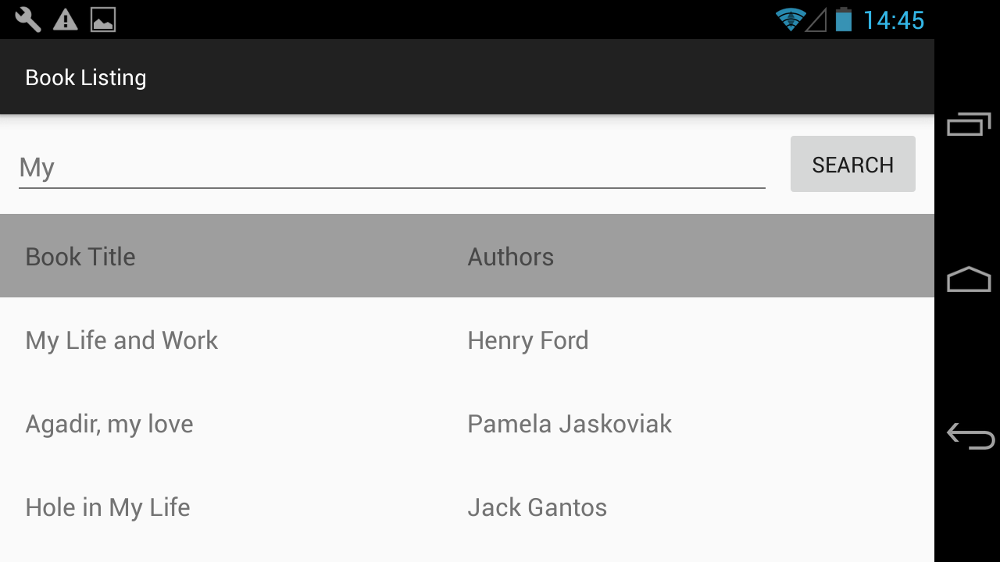

# BookListing
Books information retriever. Get books information according to user-input-keywords from the Google Books website through its API. 

Remove the space if user input space between keywords. 

Open the app to get a list of books summaries according to user-input-keywords. 

Use TaskLoader together with activity to trigger the same task, when different activity instances are created, e.g., rotating the screen. 

Implement an AsyncTaskLoader to asynchronously load data from the API. 

A progress bar is displayed while the app sending the request and waiting for the response. 

The JSON response is parsed to get the expected data. 

Exceptions like no network connection, no expected data, retrieving books information which has no authors information are handled. 

StringBuilder method are covered because the retrieved authors information from JSON is in an array. 

# App ScreenShots
        

